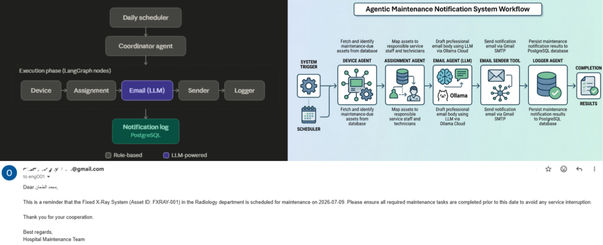

# 🏥 Agentic Maintenance Notification System

An **agent-based hospital equipment maintenance monitoring and notification system**, built with **FastAPI**, **LangGraph**, **SQLAlchemy**, and **Ollama Cloud (LLM)**.

The system automatically detects assets that are due for maintenance, identifies the responsible staff member, generates a professional reminder email (via LLM), sends it through Gmail SMTP, and logs the result in PostgreSQL — fully orchestrated and schedulable.




---

##  Project Status

**Current Stage:** LangGraph-based multi-agent orchestration — fully functional end-to-end pipeline (Device → Assignment → Email → Sender → Logger), exposed via FastAPI and automated with APScheduler.

---

##  Architecture Overview

Workflow orchestration is handled by **LangGraph**, where each stage of the pipeline is represented as a graph node operating on a shared `MaintenanceGraphState`.

```text
                API / Scheduler
                      |
                      v
              Coordinator Agent
                      |
                      v
                  LangGraph
                      |
        --------------------------------
        |              |               |
        v              v               v
   Device Node   Assignment Node    Email Node
                                        |
                                        v
                                Email Sender Tool
                                        |
                                        v
                                  Logger Node
                                        |
                                        v
                          Notification Log Database
```

### Execution Flow

```text
START
  |
  v
Device Agent Node        → fetch due assets
  |
  v
Assignment Agent Node     → map assets to responsible staff
  |
  v
Email Agent Node          → generate reminder email (LLM)
  |
  v
Email Sender Node         → send via Gmail SMTP
  |
  v
Logger Agent Node         → persist notification result
  |
  v
END
```

### Shared Workflow State — `MaintenanceGraphState`

| Field           | Type                    | Description                              |
|-----------------|--------------------------|-------------------------------------------|
| `devices`       | `dict`                   | Output of the Device Agent                |
| `assignments`   | `List[AssignmentResult]` | Assets enriched with assigned staff       |
| `emails`        | `List[EmailTask]`        | Generated email tasks                     |
| `email_results` | `List[EmailResult]`      | SMTP delivery results                     |
| `logs`          | `list`                   | Notification log records                  |

---

##  Agents

Each agent has a single, well-defined responsibility. Agents are split into two categories based on whether they use deterministic logic or an LLM.

###  Rule-Based Agents (Deterministic — No LLM)

| Agent | Responsibility | Logic |
|---|---|---|
| **`DeviceAgent`** | Retrieves assets due for maintenance and calculates priority | Pure conditional logic — compares `next_maintenance_date` to a fixed threshold to assign `HIGH` / `MEDIUM` priority |
| **`AssignmentAgent`** | Maps each due asset to its responsible staff member | Direct lookup via `AssignmentService` / `get_assignment_tool`; marks tasks as `ASSIGNED` or `UNASSIGNED` |
| **`LoggerAgent`** | Records the outcome of every notification attempt | Deterministic mapping of send results (`SUCCESS` / `FAILED`) into the notification log |
| **`CoordinatorAgent`** | Orchestrates the LangGraph workflow and aggregates results | No decision-making logic — simply invokes the compiled graph and summarizes output |

> None of the above agents perform any reasoning or text generation — they are standard rule-based / data-processing components, structured as "agents" for architectural consistency with the LangGraph pipeline.

###  LLM-Powered Agent

| Agent | Responsibility | LLM Usage |
|---|---|---|
| **`EmailAgent`** | Generates the maintenance reminder email | Uses `LLMTool` (Ollama Cloud) to generate the **email body** dynamically from a structured prompt, based on asset + staff details. The **email subject** is still generated with a static f-string (rule-based), not by the LLM. |

**Prompt design constraints enforced for `EmailAgent`:**
- Professional hospital communication tone
- Must include equipment details and asset ID
- Must include the scheduled maintenance date
- No placeholders (e.g. `[Your Name]`, `[Hospital Name]`)
- English-only output, recipient name not translated
- No explanations, comments, or subject line — body text only

---

##  Services & Tools

### Services
- `AssetService` — asset & maintenance data access
- `AssignmentService` — asset-to-staff mapping
- `NotificationLogService` — notification log persistence

### Tools
- `Assignment Tool` — fetches responsible staff for an asset
- `LLMTool` — abstraction layer over the Ollama Cloud LLM
- `Email Sender` — sends emails via Gmail SMTP, returns structured `EmailResult`
- `Notification Logging Tool` — writes notification records to PostgreSQL

---

## 🗄️ Database

**Engine:** PostgreSQL
**ORM:** SQLAlchemy

**Tables:**
- `asset`
- `staff`
- `asset_assignment`
- `asset_maintenance`
- `notification_log`

---

## 🌐 API Layer (FastAPI)

| Method | Endpoint | Description |
|---|---|---|
| `GET` | `/maintenance/health` | Health check for the maintenance service |
| `POST` | `/maintenance/run` | Triggers the full maintenance notification workflow and returns an execution summary |

---

## ⏰ Scheduler

Automated daily execution is handled via **APScheduler**, triggering the same `CoordinatorAgent` → LangGraph workflow used by the API.

Configurable via `.env`:

```env
CRON_TIME_HOUR=8
CRON_TIME_MINUTE=0
```

```text
Scheduler
    |
    v
Coordinator Agent → LangGraph Workflow → Notification Log Database
```

---

## 📁 Project Structure

```text
agentic_module/
│
├── docker/
│
├── src/
│   ├── agents/
│   │   ├── __init__.py
│   │   ├── coordinator_agent.py     # Orchestrator (rule-based)
│   │   ├── device_agent.py          # Rule-based
│   │   ├── assignment_agent.py      # Rule-based
│   │   ├── email_agent.py           # LLM-powered
│   │   └── logger_agent.py          # Rule-based
│   │
│   ├── api/                         # FastAPI routers
│   ├── core/                        # App config/settings
│   ├── db/                          # DB session/connection
│   ├── graph/                       # LangGraph state & nodes
│   ├── models/                      # SQLAlchemy ORM models
│   ├── scheduler/                   # APScheduler setup
│   ├── schemas/                     # Pydantic schemas
│   ├── services/                    # Business logic layer
│   ├── tools/                       # Reusable tools (LLM, email, DB)
│   ├── tests/
│   │
│   ├── .env
│   ├── .env.example
│   ├── main.py
│   └── requirements.txt
│
└── README.md
```


##  Getting Started

### 1. Clone & install dependencies
```bash
git clone <repository-url>
cd agentic_module
pip install -r requirements.txt
```

### 2. Configure environment variables
```bash
cp .env.example .env
```
Fill in your database credentials, Gmail SMTP credentials, Ollama Cloud API key, and scheduler timing.

### 3. Run the API server
```bash
uvicorn main:app --reload
```

### 4. Trigger the workflow manually
```bash
curl -X POST http://localhost:8000/maintenance/run
```

The scheduler will also trigger this workflow automatically at the configured time (`CRON_TIME_HOUR` / `CRON_TIME_MINUTE`).


